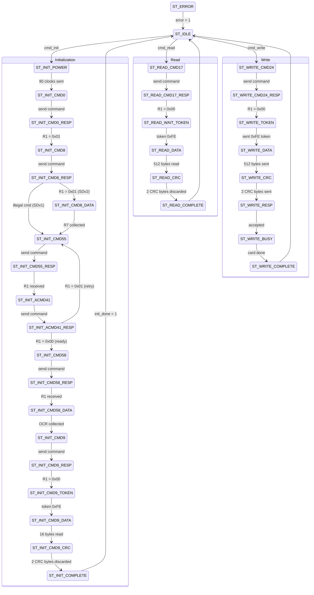

# SD Card Controller FSM — Step-by-Step Walkthrough

## Overview

The FSM has **28 states** organized into four phases:

1. **Initialization** (14 states) — powers up and configures the SD card via SPI
2. **Read** (5 states) — reads a single 512-byte block
3. **Write** (7 states) — writes a single 512-byte block
4. **Error** (1 state) — handles failures

## State Diagram

---

## Phase 1: Initialization

The SD SPI initialization follows the standard sequence defined by the SD Physical Layer specification.

### Step 1 — `ST_IDLE`
- The FSM rests here waiting for a command.
- `busy = '0'`, `CS = high` (deselected), `error = '0'`.
- When `cmd_init` is pulsed: sets `busy = '1'`, clears `init_done` and `card_sdhc`, and moves to `ST_INIT_POWER`.
- When `cmd_read` is pulsed (and card is initialized): sets `busy = '1'`, goes to `ST_READ_CMD17`.
- When `cmd_write` is pulsed (and card is initialized): sets `busy = '1'`, goes to `ST_WRITE_CMD24`.

### Step 2 — `ST_INIT_POWER` (Power-Up Dummy Clocks)
- **Purpose:** The SD spec requires ≥74 clock cycles with CS high after power-up before any commands.
- **What it does:** Sends 10 dummy bytes (0xFF) via SPI with CS held high. Each byte = 8 clocks, so 10 × 8 = 80 clocks.
- **Transition:** After `dummy_cnt >= 10` → `ST_INIT_CMD0`.

### Step 3 — `ST_INIT_CMD0` (GO_IDLE_STATE)
- **Purpose:** Software reset — puts the card into SPI mode and idle state.
- **What it does:**
  - Pulls CS low (selects card).
  - Builds CMD0 frame: `0x40 0x00 0x00 0x00 0x00 0x95` (CRC is mandatory for CMD0).
  - Sends the first byte and transitions to `ST_INIT_CMD0_RESP`.

### Step 4 — `ST_INIT_CMD0_RESP`
- **What it does:**
  - Sends remaining 5 command bytes (via the `cmd_byte_idx` counter and case statement).
  - After all 6 bytes sent, sends dummy 0xFF bytes and watches for a valid R1 response (MSB = 0).
  - **Expected response:** `0x01` (idle flag set = card is in idle state, OK).
- **Transition:** R1 = 0x01 → `ST_INIT_CMD8`. Anything else → `ST_ERROR`.

### Step 5 — `ST_INIT_CMD8` (SEND_IF_COND)
- **Purpose:** Voltage check and SD version detection. This command only exists in SD v2.0+ cards.
- **What it does:** Builds CMD8 with argument `0x000001AA` (voltage = 2.7–3.6V, check pattern = 0xAA). CRC = `0x87`.
- Sends first byte and transitions to `ST_INIT_CMD8_RESP`.

### Step 6 — `ST_INIT_CMD8_RESP`
- Sends remaining command bytes, then waits for R1 response.
- **If R1 = 0x01:** Card is SD v2.0 — proceed to read 4 bytes of R7 data → `ST_INIT_CMD8_DATA`.
- **If R1 bit 2 = 1 (illegal command):** Card is SD v1.0 or MMC — skip R7 and go directly to `ST_INIT_CMD55`.
- **Timeout:** → `ST_ERROR`.

### Step 7 — `ST_INIT_CMD8_DATA` (Read R7 Response)
- **Purpose:** Reads the 4-byte R7 response appended after R1 for CMD8.
- **What it does:** Sends 4 dummy bytes, clocking in the R7 data. The R7 should echo back `0x000001AA`.
- **Note:** The R7 data was previously stored in `r7_data` but was never checked — this signal has been removed as dead code.
- **Transition:** After 4 bytes → `ST_INIT_CMD55`.

### Step 8 — `ST_INIT_CMD55` (APP_CMD Prefix)
- **Purpose:** CMD55 tells the card that the *next* command is an application-specific command (ACMD).
- **What it does:** Sends CMD55 with argument 0x00000000.
- **Transition:** → `ST_INIT_CMD55_RESP`.

### Step 9 — `ST_INIT_CMD55_RESP`
- Sends remaining bytes, waits for R1 with MSB = 0.
- **Transition:** Valid R1 received → `ST_INIT_ACMD41`.

### Step 10 — `ST_INIT_ACMD41` (SD_SEND_OP_COND)
- **Purpose:** Starts the card's internal initialization process. The HCS bit (bit 30) in the argument tells the card we support SDHC.
- **What it does:** Sends ACMD41 with argument `0x40000000` (HCS = 1).
- **Transition:** → `ST_INIT_ACMD41_RESP`.

### Step 11 — `ST_INIT_ACMD41_RESP`
- Waits for R1 response.
- **R1 = 0x00:** Card initialization complete → `ST_INIT_CMD58`.
- **R1 = 0x01:** Card still initializing — increment `retry_cnt` and loop back to `ST_INIT_CMD55`.
- **Retry limit (50,000):** → `ST_ERROR`.
- **Any other R1:** → `ST_ERROR`.

### Step 12 — `ST_INIT_CMD58` (READ_OCR)
- **Purpose:** Read the Operating Conditions Register to check if the card is SDHC (CCS bit).
- **What it does:** Sends CMD58 with argument 0x00000000.
- **Transition:** → `ST_INIT_CMD58_RESP` → `ST_INIT_CMD58_DATA`.

### Step 13 — `ST_INIT_CMD58_DATA` (Read OCR)
- **What it does:** Reads 4 OCR bytes by shifting them into `ocr_data`.
- **Key check:** OCR bit 30 (CCS = Card Capacity Status). If set, the card is SDHC/SDXC and uses block addressing. If clear, it's SDSC and uses byte addressing.
- Sets `card_sdhc` accordingly, deselects the card (CS high), and transitions to `ST_INIT_CMD9`.

### Step 14 — `ST_INIT_CMD9` (SEND_CSD)
- **Purpose:** Read the Card-Specific Data register to determine total capacity.
- **What it does:** Re-selects the card (CS low), sends CMD9.
- **Transition:** → `ST_INIT_CMD9_RESP`.

### Step 15 — `ST_INIT_CMD9_RESP`
- Waits for R1 = 0x00.
- **Transition:** → `ST_INIT_CMD9_TOKEN`.

### Step 16 — `ST_INIT_CMD9_TOKEN`
- **Purpose:** After CMD9's R1, the card sends a data start token (0xFE) before the CSD payload.
- **What it does:** Keeps sending dummy bytes until it receives 0xFE.
- **Timeout:** → `ST_ERROR`.
- **Transition:** 0xFE received → `ST_INIT_CMD9_DATA`.

### Step 17 — `ST_INIT_CMD9_DATA` (Read 16 CSD Bytes)
- **What it does:** Reads 16 bytes into `csd_buf(0)` through `csd_buf(15)`.
- **Transition:** After byte 15 → `ST_INIT_CMD9_CRC`.

### Step 18 — `ST_INIT_CMD9_CRC`
- **What it does:** Reads and discards 2 CRC bytes that follow the CSD data block.
- **Transition:** After 2 bytes → `ST_INIT_COMPLETE`.

### Step 19 — `ST_INIT_COMPLETE`
- **Purpose:** Parse the CSD and compute total card capacity.
- **What it does:**
  - **SDHC (CSD v2.0):** Extracts 22-bit C_SIZE from `csd_buf[7:9]`, computes `(C_SIZE + 1) × 1024` blocks.
  - **SDSC (CSD v1.0):** Extracts 12-bit C_SIZE and 3-bit C_SIZE_MULT, computes `(C_SIZE + 1) × 2^(C_SIZE_MULT + 2)` blocks.
- Sets `init_done = '1'`, `fast_mode = '1'` (signals parent to switch to 25 MHz), CS high.
- **Transition:** → `ST_IDLE`.

---

## Phase 2: Single-Block Read (CMD17)

### Step 20 — `ST_READ_CMD17`
- **Purpose:** Issue a CMD17 (READ_SINGLE_BLOCK) command.
- **What it does:**
  - CS low.
  - For SDHC: passes `block_addr` directly (block addressing).
  - For SDSC: shifts `block_addr` left by 9 bits (byte addressing = block × 512).
  - Sends command frame.
- **Transition:** → `ST_READ_CMD17_RESP`.

### Step 21 — `ST_READ_CMD17_RESP`
- Sends remaining command bytes, waits for R1 = 0x00.
- **Transition:** R1 = 0x00 → `ST_READ_WAIT_TOKEN`. Other → `ST_ERROR`.

### Step 22 — `ST_READ_WAIT_TOKEN`
- **Purpose:** Wait for the data start token (0xFE).
- Also checks for data error tokens (bits [7:5] = 000 and bit 4 = 0).
- **Timeout:** → `ST_ERROR`.
- **Transition:** 0xFE received → `ST_READ_DATA`.

### Step 23 — `ST_READ_DATA` (Read 512 Bytes)
- **What it does:** For each of the 512 bytes:
  - Sends a dummy 0xFF to clock data out of the card.
  - Puts the received byte on `data_out` and pulses `data_out_valid`.
  - The parent module captures each byte as it arrives.
- **Transition:** After byte 511 → `ST_READ_CRC`.

### Step 24 — `ST_READ_CRC`
- Reads and discards 2 CRC bytes following the data block.
- **Transition:** → `ST_READ_COMPLETE` → `ST_IDLE`.

---

## Phase 3: Single-Block Write (CMD24)

### Step 25 — `ST_WRITE_CMD24`
- **Purpose:** Issue CMD24 (WRITE_BLOCK).
- Same address logic as CMD17 (block vs. byte addressing based on `card_sdhc`).
- **Transition:** → `ST_WRITE_CMD24_RESP`.

### Step 26 — `ST_WRITE_CMD24_RESP`
- Waits for R1 = 0x00.
- **Transition:** → `ST_WRITE_TOKEN`.

### Step 27 — `ST_WRITE_TOKEN`
- Sends the data start token `0xFE` to tell the card that data bytes follow.
- Pulses `data_in_req` to request the first byte from the parent.
- **Transition:** → `ST_WRITE_DATA`.

### Step 28 — `ST_WRITE_DATA` (Write 512 Bytes)
- **What it does:** For each of the 512 bytes:
  - Takes `data_in` (provided by parent) and sends it via SPI.
  - Pulses `data_in_req` to request the next byte.
- **Transition:** After byte 511 → `ST_WRITE_CRC`.

### Step 29 — `ST_WRITE_CRC`
- Sends 2 dummy CRC bytes (0xFF). SPI mode doesn't require valid CRC.
- **Transition:** → `ST_WRITE_RESP`.

### Step 30 — `ST_WRITE_RESP`
- **Purpose:** Read the data response token from the card.
- **Format:** `xxx0sss1` where `sss` = status:
  - `010` = data accepted ✓
  - `101` = data rejected (CRC error)
  - `110` = data rejected (write error)
- **Transition:** Accepted → `ST_WRITE_BUSY`. Rejected → `ST_ERROR`.

### Step 31 — `ST_WRITE_BUSY`
- **Purpose:** The card pulls MISO low while it programs the flash internally.
- **What it does:** Keeps sending 0xFF and checking if MISO returns to 0xFF (card done).
- **Transition:** MISO = 0xFF → `ST_WRITE_COMPLETE` → `ST_IDLE`.

---

## Error Handling

### `ST_ERROR`
- Deselects the card (CS high).
- Sets `error = '1'`.
- Returns to `ST_IDLE`.
- The parent module can detect the error and decide whether to retry.

---

## Command Sending Pattern

Every SD command follows the same 6-step pattern used repeatedly in the FSM:

1. **Build:** `build_cmd(index, argument, crc)` assembles the 48-bit frame: `01 | 6-bit cmd | 32-bit arg | 8-bit CRC`
2. **Send byte 0:** Load first byte into `send_byte`, set `send_pending = '1'`, start `cmd_byte_idx` at 1
3. **Send bytes 1–5:** In the `_RESP` state, the case statement on `cmd_byte_idx` sends each subsequent byte
4. **Poll for R1:** After all 6 bytes, send 0xFF dummies and watch for MSB = 0 in received data
5. **Read extra data** (if applicable): R7 (4 bytes), OCR (4 bytes), CSD (16 bytes + token + CRC)
6. **Check response** and transition to the next state or `ST_ERROR`
